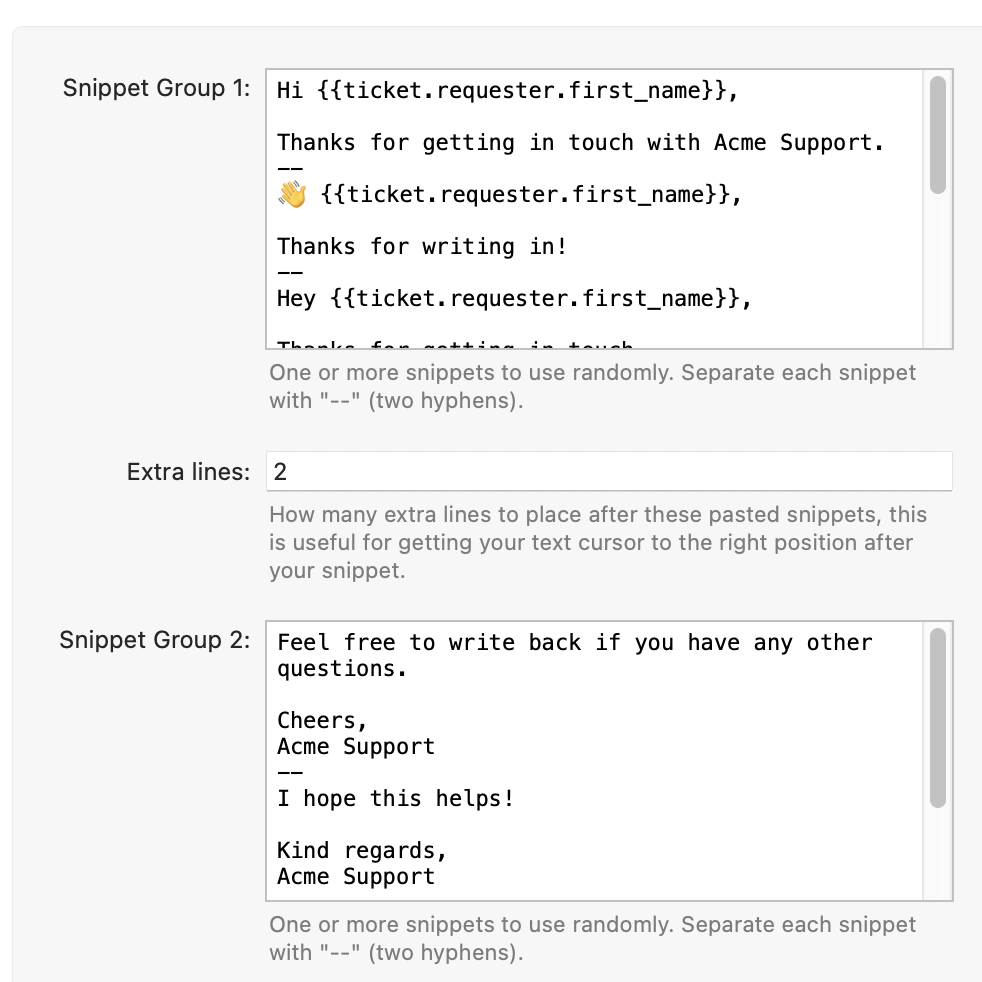
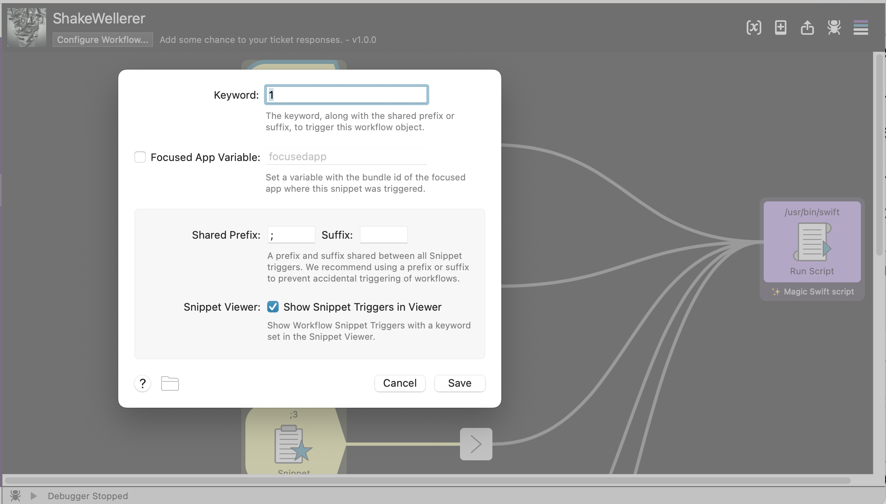

### ShakeWellerer

ShakeWellerer is an Alfred Workflow that allows you to setup 5 groups of snippets with an associated trigger. Each time a snippet group is triggered, a random snippet from that group is pasted into the active application.

It can be used to add some variation to your canned ticket responses, or to quickly paste some random variation of commonly used text.

Inspired by [@yamiacat](https://github.com/yamiacat)'s ShakeWeller, this edition focuses on flexibility, ease of use and making use of Alfred's Workflow configuration.

#### Features
- Supports Emoji ✨!
- Uses the Mac OS clipboard in compliance with [NSPasteboard.org](http://nspasteboard.org/) to preserve clipboard history.
- Supports customization of newlines and spacing.
- Based on Swift, so it's fast and lightweight*.

*Kinda, probably doing a bit much for the task at hand.

#### Configuration

**Snippets**
Snippets can be defined in the Alfred Workflow Configuration

Each snippet is delimited by `--` (two hyphens).

Each snippet group can have its _Extra Lines_ set separately. This is the number of newlines that will be added after the snippet is pasted. This is useful for getting your cursor to the next line after your snippet to continue writing, but can be turned off. Newlines and spacing within snippets are kept so you can optionally just include them in your snippet.

**Keywords**
Each snippet group can have a keyword assigned that is used to trigger that snippet group.

